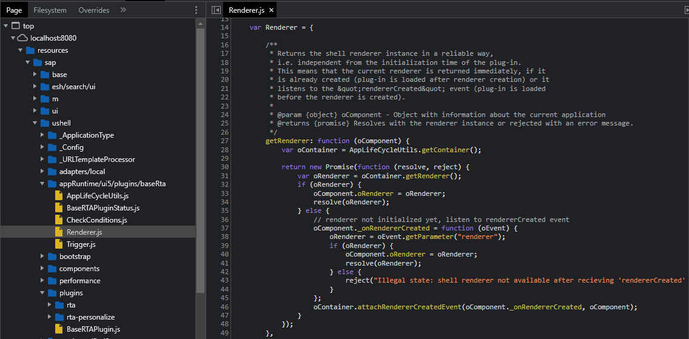

# FLP Plugin Session Timeout

This is a slightly refreshed approach to the plugin mentioned by the [SAP Documentation](https://help.sap.com/docs/Portal_Service/8422cb487c2146999a2a7dab9cc85cf7/87764543e31247b5b471c06e3f6da6fc.html?locale=en-US). I wanted to have a look at how FLP Plug-In development works in general.

For the purpose or using this Repository as a starting point at any time, I've kept the `getRenderer` function as well as some of the dummy code from the generator.

This Plug-In is supposed to keep the FLP sessions alive by sending small (HTTP HEAD) requests in an interval to the SAP system. Be aware though that before using something like Plug-In development to do this, there are various ways to go about this. One approach could be using the native "Gateway Time-Out Warning" settings explained [here](https://www.saptechnicalguru.com/setting-fiori-gateway-time-out-and-time-out-warning/). Also mentioned in SAP OSS Note [3248472](https://launchpad.support.sap.com/#/notes/3248472) and [2955208](https://launchpad.support.sap.com/#/notes/2955208).

## Activate & Configure the Plug-In

It'd be basically the same as described [here](https://help.sap.com/docs/ABAP_PLATFORM_BW4HANA/a7b390faab1140c087b8926571e942b7/d58602924af34fc3816d44ddb6a9e911.html?locale=en-US#activating-and-configuring-the-example-ui-plug-in).

## Open Question

I'm not sure how exactly to '[Make sure that your plug-in is robust if more than one instance is loaded](https://help.sap.com/docs/ABAP_PLATFORM_BW4HANA/a7b390faab1140c087b8926571e942b7/1b305d3e6b864e32a9464a13f3076b8b.html?locale=en-US#make-sure-that-your-plug-in-is-robust-if-more-than-one-instance-is-loaded)'. Is it something that is done from within the Plug-In scope itself or do we have to go into the window scope here (i.e. the "sap-ushell-config"?)

As the docs state:
> Even if your plug-in implementation is a singleton by nature, multiple instances might be created due to configuration, and your plug-in must be able to handle this in a robust way.

If you know the answer: DM me anywhere or open an Issue/PR. I'd love to know.

### GetRenderer Impl

Implementation based on this [SO Answer](https://stackoverflow.com/a/66147223/10323879) and SAP itself (see below image)

## Credits

This project has been generated with 💙 and [easy-ui5](https://github.com/SAP)

- [SAP Fiori Launchpad Documentation (Developing Plug-Ins)](https://help.sap.com/docs/ABAP_PLATFORM_BW4HANA/a7b390faab1140c087b8926571e942b7/cc03f57993f54a969f3c6a9d59b6d3f0.html?locale=en-US)
- [How are Plug-Ins loaded into the FLP?](https://blogs.sap.com/2018/12/12/how-it-works-sap-fiori-launchpad-plugins/)
- [Promisify `_getRenderer`](https://stackoverflow.com/a/66147223/10323879)
- [Fiori Renderer](https://ui5.sap.com/sdk/#/api/sap.ushell.renderers.fiori2.Renderer%23methods/Summary)
- FLP Sandbox adjusted with the help of
  - [sandbox.js](https://sapui5.hana.ondemand.com/sdk/test-resources/sap/ushell/bootstrap/sandbox.js)
  - [Test FLP](https://sapui5.hana.ondemand.com/sdk/test-resources/sap/ushell/shells/sandbox/fioriSandbox.html#Shell-home)
- Other Examples
  - [Whats New - Popup](https://blogs.sap.com/2017/10/12/create-a-welcome-popup-for-portal-fiori-launchpad-and-freestyle-sites/)
  - [Snowflakes](https://blogs.sap.com/2019/11/26/surprise-your-users-with-a-true-x-mas-user-experience-let-it-snow/)
  - [Language Switch](https://blogs.sap.com/2017/05/24/allow-users-to-switch-language-in-the-fiori-launchpad-using-ui-plugins/)
  - [HeaderItem (Renderer) Config](https://blogs.sap.com/2019/08/12/fiori-launchpad-plugin-extension-with-headeritem-disappears-solution-and-configuration-options/)
  - [XSA Config](https://blogs.sap.com/2020/03/04/xsa-fiori-launchpad-on-premise-configuration-with-sap-fiori-launchpad-plugins/)
  - [Example Plugin with UI (by SAP)](https://ui5.sap.com/test-resources/sap/ushell/demoapps/UIPluginSampleAddHeaderItems/Component.js)
